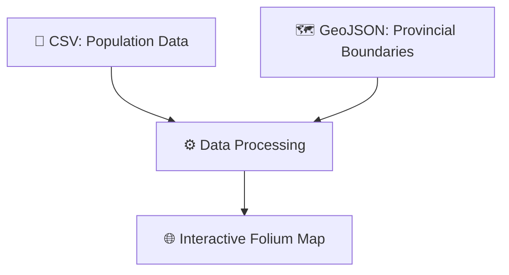

# 🌍 **Iran Population Density Visualization**

> _Transforming 2025 population data into meaningful geographic insights_


A **sophisticated geospatial analysis** project that visualizes the latest 2025 UN population data with rich interactivity and elegant mapping.

---

## ✨ **Key Features**

| 📌 **Feature**             | 📝 **Description**                                                                |
| -------------------------- | --------------------------------------------------------------------------------- |
| 📊 **Data Integration**    | Seamlessly combines population statistics with accurate provincial boundaries     |
| 🧮 **Density Calculation** | Calculates people per square kilometer (km²) for each Iranian province            |
| 🗺 **Interactive Mapping**  | Builds dynamic **choropleth maps** using Folium with zoom & pan support           |
| 🔍 **Detailed Tooltips**   | Hover to reveal province names and exact population density values                |
| 🎨 **Visual Styling**      | Utilizes **YlGnBu** color gradients for intuitive and aesthetically pleasing maps |

---

## 📂 **Data Pipeline Overview**



---

## 🚀 **Getting Started**

Follow these steps to run the visualization locally:

1. **Install dependencies**:

   ```bash
   pip install -r requirements.txt
   ```

2. **Launch analysis notebook**:

   ```bash
   jupyter notebook main.ipynb
   ```

3. **Explore the map**:

   - View generated map: [`data/ir_population_density.html`](data/ir_population_density.html)
   - Sample output:
     

---

## 📊 **Data Sources**

- 📈 **Population Data**: [`ir-population-2025.csv`](data/ir-population-2025.csv)
- 🗺 **Geo Boundaries**: [`ir-provinces.json`](data/ir-provinces.json)

---

## 📜 **License**

This project is released under the **MIT License**.
See [`LICENSE`](LICENSE) for full details.

---

> 💡 **\*Tip**: You can zoom and pan the map to explore population density at a granular level.\*

---

Let me know if you'd like a version tailored for GitHub, Jupyter Notebook, or a documentation site!
